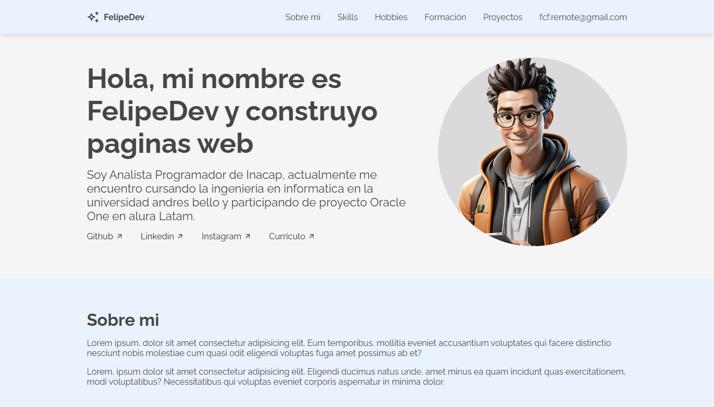

# Portafolio de Proyecto - Challenger Oracle One

Este es el portafolio del proyecto desarrollado como parte del programa Challenger de Oracle One. Este sitio web muestra mis habilidades y proyectos desarrollados durante el curso.




## Índice

- [Características](#características)
- [Tecnologías Utilizadas](#tecnologías-utilizadas)
- [Instalación](#instalación)
- [Uso](#uso)
- [Contribuciones](#contribuciones)
- [Contacto](#contacto)

## Características

- Diseño responsivo y amigable para el usuario.
- Sección de proyectos que muestra mis trabajos más destacados.
- Integración con tecnologías modernas.
- Navegación intuitiva.

## Tecnologías Utilizadas

Este proyecto utiliza las siguientes tecnologías:

- **HTML5**: Para la estructura del sitio.
- **CSS3**: Para el estilo y la presentación.
- **JavaScript**: Para la interactividad.
- **Git**: Para el control de versiones.
- **GitHub Pages**: Para la implementación.

## Instalación

Para visualizar el portafolio en tu máquina local, sigue estos pasos:

1. Clona el repositorio:
   ```bash
   git clone https://github.com/fcf-lennon/challenger_portafolio_oracle_one.git
2. Abre el archivo index.html en tu navegador.

## Uso

Navega por las secciones del portafolio para explorar mis proyectos, habilidades y experiencias. Puedes interactuar con los elementos para conocer más sobre cada proyecto.

## Contribuciones

Si deseas contribuir a este proyecto, siéntete libre de abrir un issue o enviar un pull request. Apreciaré cualquier sugerencia o mejora.

## Contacto

Para más información o para ponerte en contacto, puedes encontrarme en:

- [GitHub](https://github.com/fcf-lennon)
- [Linkedin](https://www.linkedin.com/in/felipe-carrasco-farfan/)
